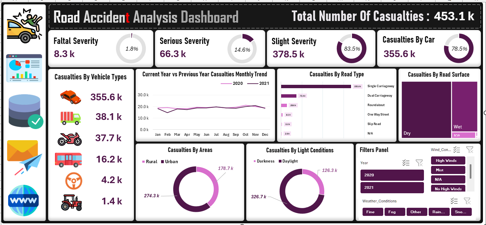

# 🚗 Road Accident Analysis Dashboard

**Dataset:** 2020–2021  
**Records Analyzed:** 300,000+ road accident records  

---

## ⭐ Problem Statement

Road accidents are a critical public safety issue, but raw accident datasets are often **large, messy, and difficult to interpret**. Stakeholders—traffic authorities, urban planners, and safety organizations—struggle to identify **patterns, high-risk factors, and actionable insights** from unstructured data.

**Challenge:** Convert over 3 lakh accident records into a **comprehensive, interactive, and decision-driving dashboard** to help authorities reduce accidents and improve public safety.

---

## 🎯 Objective

Build an **interactive Excel dashboard** to:

- Analyze accident severity distribution (Fatal, Serious, Slight)  
- Identify high-risk vehicle types and behaviors  
- Examine environmental and road conditions contributing to accidents  
- Compare Urban vs Rural accident patterns  
- Track Year-over-Year trends and monthly variations  
- Generate actionable insights for decision-makers  

---

## ⚙️ Methodology

**Tools & Techniques:** Microsoft Excel, Power Query, Pivot Tables, Pivot Charts, Slicers  

### 1️⃣ Data Cleaning & Transformation
- Imported raw accident data into Power Query  
- Standardized accident categories, vehicle types, and environmental conditions  
- Removed duplicates, corrected inconsistencies, and prepared a clean dataset  

### 2️⃣ Analysis & Visualization
- Built KPIs to track **Total Casualties, Fatal, Serious, Slight**  
- Created Pivot Charts for **Vehicle Type, Area, and Environmental Conditions**  
- Added interactive slicers for **Year, Area, Vehicle Type, Weather, and Light Conditions**  

### 3️⃣ Dashboard Design
- Designed a **visually appealing and interactive dashboard**  
- Structured KPIs and charts for quick insights  
- Ensured usability for non-technical stakeholders  

---

## 📊 Key Findings

### 🚨 Overall Casualties
- **Total:** 453.1k  
- **Fatal:** 8.3k | **Serious:** 66.3k | **Slight:** 378.5k  

### 🚗 Vehicle Type Analysis
- Cars: 355.6k  
- Trucks: 38.1k  
- Motorcycles: 37.7k  
- Buses: 16.2k  
- Others: 4.2k  
- Tractors: 1.4k  

### 🌍 Area Analysis
- Urban: 274.3k  
- Rural: 178.7k  

### 🌦 Environmental Insights
- **Weather:** Fine (359.3k), Rain (66.2k), Fog (2.6k), Snow (4.2k)  
- **Road Surface:** Dry (298.4k), Wet (137.7k), Ice (15.6k)  
- **Light Conditions:** Daylight (326.7k), Darkness (126.3k)  

### 📈 Trend Analysis
- Monthly YoY comparison shows **peak accidents during monsoon months**  
- **Urban areas** show higher accident rates, especially involving cars  

---

## 💡 Actionable Insights & Recommendations

### 1️⃣ High-Risk Vehicles
- Cars and trucks cause the majority of casualties → **targeted safety campaigns, stricter enforcement, and monitoring**

### 2️⃣ Urban Area Focus
- Urban accidents are more frequent → **improve traffic management, pedestrian zones, and urban road safety policies**

### 3️⃣ Environmental Risks
- Fine weather & dry roads still see high accident numbers → **driver awareness programs focusing on speed and distractions**

### 4️⃣ Infrastructure & Policy Improvements
- Smart traffic monitoring systems in accident-prone areas  
- Better street lighting and road surface maintenance  
- Regular driver training and public awareness campaigns  

### 5️⃣ Data-Driven Decisions
- Maintain a **live accident dataset** to identify **emerging high-risk zones**  
- Use dashboard KPIs to monitor the **impact of interventions**  

> These recommendations not only **reduce accidents**, but also **optimize resource allocation** for traffic authorities, demonstrating the tangible impact of data analysis on public safety.

---

## 🛠 Tools & Skills Applied

- **Microsoft Excel:** Data modeling, Pivot Tables, Pivot Charts  
- **Power Query:** Data cleaning and transformation  
- **Slicers & Filters:** Interactive dashboard functionality  
- **KPI Visualization:** Highlight critical insights for decision-making  
- **Analytical Thinking:** Extracted actionable insights from large datasets  

---

# 🖼 Dashboard Preview

### KPI View  

### Full Dashboard  

---
## 🙌 Author

**Subham – Aspiring Data Analyst**

> This project demonstrates my ability to transform **complex datasets into actionable business insights**, create **interactive dashboards**, and **communicate findings effectively** to both technical and non-technical stakeholders.
